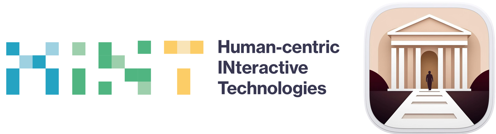

# ArtMyWay | DesignersForCulture 

**Corso di Laurea:** Ingegneria Informatica  
**Anno Accademico:** 2024/25  
**Università:** Politecnico di Milano  
**Docente:** Professoressa Maristella Matera  

### Membri del Team:
- Mattia Colombo
- Carmen Giaccotto
- Alessia Franchetti-Rosada
- Federico Previtali
- Manoueil Michael Halim Riad Hanna
- Valentina Petrignano
- Michele Arrigoni

### Descrizione del Progetto:
Il nostro progetto si propone di esplorare e sviluppare soluzioni innovative che combinino tecnologia e cultura con l'obiettivo di rendere l'arte e il patrimonio culturale più accessibili e coinvolgenti per gli adolescenti (16-19 anni). L'iniziativa mira anche a promuovere una cittadinanza più consapevole e partecipativa.

  
  

### C1 - Needfinding:
 - Gli obiettivi di questa fase consistono nell’osservare e nel comprendere i modi in cui gli adolescenti eseguono le attività che il nuovo sistema interattivo si propone di supportare. Il team si è focalizzato sull’analisi degli obiettivi degli utenti e delle loro pratiche per generare intuizioni progettuali significative e definire i requisiti per lo sviluppo del sistema. Per meglio comprendere le esigenze del target, il team ha condotto interviste con adolescenti e operatori museali.
È stato raccolto tutto il lavoro svolto in una presentazione. Clicca [**qui**](https://www.canva.com/design/DAGTSNj9lJg/yVSnIUh4KBzx_JAO72yTgw/edit?utm_content=DAGTSNj9lJg&utm_campaign=designshare&utm_medium=link2&utm_source=sharebutton) per accedere alla versione interattiva della presentazione.

- È stato stilato un documento in cui i risultati sono stati raccolti in maniera più approfondita e dettagliata. Clicca [**qui**](https://github.com/carmengiaccotto/project_human_computer_interaction_24-25/blob/main/C1/docs/report/final_report_needfinding.pdf) per accedervi.

- È stato inoltre creato un sondaggio per raccogliere dati sulle preferenze e sulle barriere che i giovani incontrano durante le visite ai musei. Clicca [**qui**](https://g9dzinv68sa.typeform.com/to/GA28hC7C) per accedervi.

### C2 - Raffinamento e Focus:
- Gli obiettivi di questa fase consistono nell'affinare ulteriormente l'ambito del progetto mediante ulteriori attività di needfinding e nell'identificare con precisione i bisogni principali degli utenti. Sono state condotte attività di brainstorming per esplorare idee e intuizioni e sono state selezionate quelle che rispondono al meglio alle esigenze individuate. È stato raccolto tutto il lavoro svolto in una presentazione. Clicca [**qui**](https://www.canva.com/design/DAGU9dRIH_8/2-LSVHoigaZfku9RytmWmg/edit?utm_content=DAGU9dRIH_8&utm_campaign=designshare&utm_medium=link2&utm_source=sharebutton) per accedere alla versione interattiva della presentazione.

- Il nome scelto per il progetto, **ArtMyWay**, riflette il cuore del nostro obiettivo: offrire agli utenti un'esperienza artistica personalizzata e su misura. Comunica immediatamente la soluzione proposta rendendola intuitiva e memorabile e sottolinea il supporto specifico fornito, come visite adattate al tempo disponibile e audioguide personalizzate.

- La nostra **value proposition** cattura l'essenza del valore che offriamo con ArtMyWay: **"Rendiamo l'arte un gioco da ragazzi"**. Rendiamo l'esperienza artistica semplice, coinvolgente e accessibile a tutti.

### C3 - Task, Storyboard e Primi Prototipi:
- Gli obiettivi di questa fase consistono nel definire i principali task utente e nel creare i primi prototipi del progetto. E' stato sviluppato uno storyboard per visualizzare il flusso d’interazione e sono stati creati due prototipi di wireframe su Figma per esplorare modalità alternative di implementazione. È stato raccolto tutto il lavoro svolto in una presentazione. Clicca [**qui**](https://www.canva.com/design/DAGVhLIJ1a8/aoS16_-NtIoWaFw2ojKdWg/edit?utm_content=DAGVhLIJ1a8&utm_campaign=designshare&utm_medium=link2&utm_source=sharebutton) per accedere alla versione interattiva della presentazione.

- [**Prototipo 1**](https://www.figma.com/design/FBuBTsykLnBfEd7NLKxSYB/Prototipo-1---DesignersForCulture?node-id=0-1&t=Usa58k1snDNulU7z-1) - Mobile App

- [**Prototipo 2**](https://www.figma.com/design/OihEWnZD8qJsFjCLEXBnaA/Prototipo-2---DesignersForCulture?node-id=0-1&t=3SZ4D51RgYHAtL8j-1) - Sito Web
